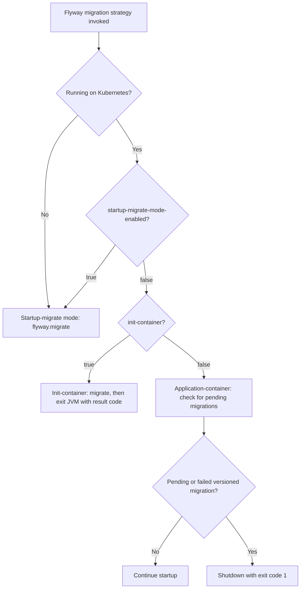

# Migration modes & strategy resolution

The starter registers a custom Spring Boot `FlywayMigrationStrategy`
(`FlywayMigrationConfiguration#customFlywayMigrateStrategy`). Instead of always migrating on startup,
`FlywayMigrationStrategyResolver` selects one of three behaviours based on the platform and the
`database-migration.*` properties.

## How a strategy is chosen

Kubernetes is detected via `CloudPlatform.KUBERNETES.isActive(environment)`
(driven by `spring.main.cloud-platform`).

## The three strategies

`FlywayMigrationStrategyService` implements them:

- **Startup-migrate mode** (`executeStartupModeStrategy`) — runs `flyway.migrate()` in-process and
  lets the application continue, exactly like a plain Spring Boot service. Used outside Kubernetes, or
  when `startup-migrate-mode-enabled=true`. Best for local development.

- **Init-container mode** (`executeInitContainerStrategy`) — runs `flyway.migrate()` and then the pod
  terminates. This is the dedicated migration job that runs before the application pods start. Used on
  Kubernetes when `startup-migrate-mode-enabled=false` and `init-container=true`.

- **Application-container mode** (`executeApplicationContainerStrategy`) — does **not** migrate. It
  inspects `flyway.info()` and, if any `VERSIONED` migration is in state `PENDING` or `FAILED`, the
  migration job has not (yet) finished successfully, so the application refuses to start and shuts
  down with exit code 1. If nothing is pending, startup continues. Used on Kubernetes when
  `startup-migrate-mode-enabled=false` and `init-container=false`.

## Shutdown and exit codes

`ShutdownService` terminates the JVM via `SpringApplication.exit(ctx, ...)` followed by `System.exit`.
The exit code is meaningful for the Kubernetes job:

- After a successful init-container migration the JVM exits with code **0**.
- If the migration throws in init-container mode, the resolver logs the error and exits with code
  **1**. In startup-migrate mode the exception is re-thrown instead (no forced shutdown).
- In application-container mode a still-pending/failed migration leads to a shutdown with code **1**.

Forced shutdown only happens in init-container mode (when `init-container=true` and
`startup-migrate-mode-enabled=false`); in all other modes the application keeps running.

## Related

- [Configuration reference](configuration.md)
- [Kubernetes deployment](kubernetes-deployment.md)
- [Getting started](getting-started.md)
- [jeap-spring-boot-db-migration-starter](../README.md)
